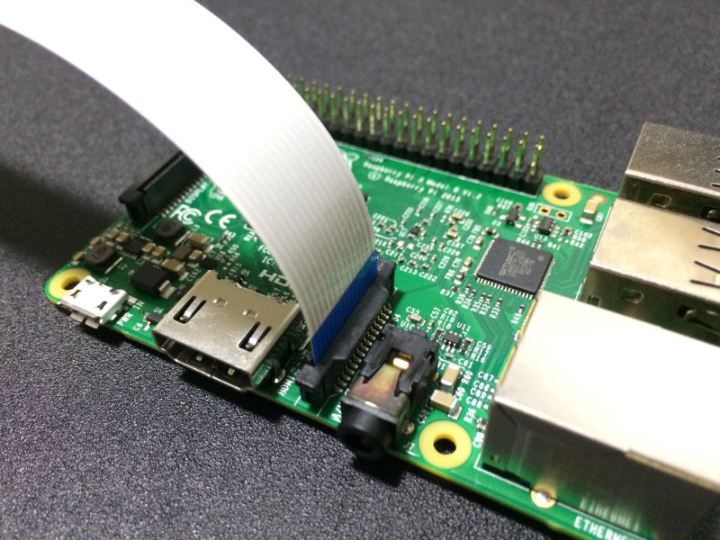

+++
title = '3D Printing 0-100'
date = '2023-11-30'
subtitle = 'Creating a low friction 3D printing system.'
author = 'Ivy Duggan'
draft = false
tags = [
  'workflow',
  'backups',
  'raspberry pi',
  '3d-printing',
  'dev ops',
]
header_img = ""
description = ""
subtitle = ""
header_img = ""
toc = true
categories = []
series = []
+++

# Impetus

Okay so obviously 3d printing is not new. I've been aware of it for about 10 years or so, and I remember vividly seeing so many of these plywood boxes in every makerspace & home workshop in the Las Vegas tech scene:

## The Problem with the King

3d printing is an incredibly hard problemspace to work in. Consider how often a 2d printer fails to work correctly, and then the idea of adding the third dimension clearly makes everything harder. So, with most new technology, it **sucked**...

If you wanted to 3d print in 2012 you needed:

- lots of money
- lots of time
- lots of effort
- lots of ibuprofen
- lots of patience

and even then, results were not that great. Filament composition was poor, the software & firmware was a mess, and the idea of creating a coherent UI/UX flow was unheard of in the consumer space. So I ignored FDM printing for a while...

### Consumerism Succeeds

Until Amazon showed me an [Ender 3 v2 Neo](https://store.creality.com/products/ender-3-v2-neo-3d-printer) for under 300$ shipped to my apartment in 2 days and I just bought it.

Why the Ender 3 v2 Neo? It had a few quality of life improvements over other Ender 3 priced printers:

- quiet motherboard
- quiet powersupply
- quiet stepper drivers
- PEI removable bed
- auto bed leveling
- metal bowden gears

and most of all: - large aftermarket support

#### Technology versus UI/UX

Over the past decade, 3d printing technology and software has evolved massively. The remaining hurdles for normal people using 3d printers all revolve around the user experience flow. Here is the typical flow:

1. Download model
1. Open slicer software
1. slice
1. export gcode to sd card
1. bring sd card to printer
1. use a small lcd to select file to print
1. return in a few hours, usually with zero feedback on print progress/status unless you check the physical machine
1. pry print off the bed

Compare to a modern 2d printer flow:

1. Download file
1. Print dialog
1. Remote print using CUPS/airprint
1. Pick up print-out

- additionally, 2d printers don't have to have their output area (i.e. printed tray) before printing again, but 3d printers (usually) do

[Raspberry Pi 3 Model B Plus Rev 1.3](https://www.raspberrypi.com/products/raspberry-pi-3-model-b-plus/)

So if you are researching a 3d printer, I'd advise that to really have a worthwhile tool, there is more than just the printer. The following is my guide to the various levels of rabbithole you can fall down.

### What to Fix

The main issues with a stock Ender type systems are simple:

1. Slow - due to lots of engineering reasons, the physical max print speed of an ender 3 is lower than other kinds. This is an inherent limit of the system, so we have to make the workflow around it as fast as possible to compensate.
1. Dumb - there is no wifi connectivity, remote monitoring, or any kind of web interface. Only a physical screen and dials. This can be a pro or a con, as it allows you to add your own interface (I use octoprint, more info below). I would prefer my printer be dumb and off of my personal network, since I then have control over the entire monitoring system.
1. Material choice - Due to the hotend & bowden feed system, certain filament types are not feasible on a stock ender, such as many composites or flexible filaments. This is usually alleviated through large physical modifications to the print system, such as changing major components.

#### Level 1: Physical Basics

I specifically picked my printer because it came with a PEI magnetic steel bed. Basically, instead of scraping the plastic off a piece of glass, I take off a thin piece of steel, and flex it until the print comes off. The quality of life improvement is massive, but is also allows the use of multiple beds. For the first round of upgrades, I'd recommend the following:

- Extra print beds (allows swapping between prints, reducing downtime) - <https://www.amazon.com/gp/product/B07X3WBNPX>
- A physical fire alarm to mount nearby - <https://www.amazon.com/gp/product/B088KJ93M3>
- Some simple printable upgrades
  - Bed locks to keep the bed level over time - <https://www.thingiverse.com/thing:5858852>
  - Replacement extrusion caps for if/when you break them - <https://www.printables.com/model/194927-ender-3v2-4040-extrusion-cap>
  - Another extrusion cap - <https://www.printables.com/model/60939-frame-cap-for-v-slot-frames-ender-3-v2>
  - Display cover - <https://www.printables.com/model/263173-ender-3-v2-display-cover>
  - Cable clips - <https://www.printables.com/model/344807-klip-organizer-kabli-drukarka-3d>

#### Level 2: Smarten up that Printer

Now here is where things get interesting! We're going to add a single board computer running
<https://octoprint.org/>. There are a lot of options for an octoprint host, such as

1. old laptop/desktop
1. (some) android phones
1. single board computers

Hardware Selection

I'd recommend selecting an SBC if possible. While most of the octoprint configuration I've found useful so far has been entirely reproducable on the other systems, the easy ability to add sensors & switches (such as auto-on/off) is worth it. Most guides are built for Raspberry Pi's, but any moderately common SBC with >1GB of ram would work. A brief comparison of some SBC's

{}

I ended up using a Raspberry Pi 3B+ because I had it on hand, but anything newer is also fine.

### Webcam selection

On many SBC's, there are 1-2 CSI camera connectors. These use this flat flex ribbon cable + Zero Force (ZF) connectors:

While these are useful and plentifulm, I would recommend a USB webcam over these if you don't already have one or more. It is much easier to disconnect USB than a CSI connector, which can be a hassle when working on the printer.

<https://www.raspberrypi.com/products/camera-module-v2/> vs c920

<https://www.amazon.com/dp/B07P8337J7> ribbon cable

Putting it Together
<https://www.printables.com/model/106225-modular-snap-together-raspberry-pi-2b3b3b4-case-w-> rpi case
<https://www.printables.com/model/161185-snap-fit-case-for-raspberry-pi-camera-module-2> rpi cam case
<https://www.printables.com/model/347669-v-slot-mounting-base-modular-mounting-system-gopro> modular mounting ender mount
<https://www.printables.com/model/9693-modular-mounting-system-gopro-genderaxis-changer> mounting axis switcher
<https://www.thingiverse.com/thing:2194278> modular mounting systems

Another classic octoprint gotcha - make sure to tape over the +5v pin on the USB cable from the SBC to the printer. Otherwise weird power things can occur. Kaptan tape or electrical tape are both solid options.
<https://community.octoprint.org/t/raspberry-pi-usb-power/12430>
A good quality power supply is essential! save yourself the headache and buy one that specifically says its rating, such as <https://www.amazon.com/gp/product/B07TYQRXTK> power supply

A major feature that I wanted is to turn the entire printer on/off from the WebUI. This is easily done with a relay like [this one](https://www.amazon.com/gp/product/B00WV7GMA2). I have my SBC on the "always on" outlet, then my printer & lamp on the "normally off" outlets. It's also very easy to create your own header to attach to the SBC GPIO pins, such as [this](https://www.amazon.com/gp/product/B07ZK5F8HP). (No soldering required!)

Software:
<https://www.raspberrypi.com/software/>

rpi imager & flash

note config settings
Slicer
<https://www.prusa3d.com/page/prusaslicer_424/>
<https://help.prusa3d.com/article/sending-files-to-octoprint-duet_1663>

Plugins - <a href='resources/plugin-list.json' download>Download Plugin_list.json</a>
Plugins - <a href='resources/plugin-list-creality.json' download>Plus Creality Temp Fix Plugins</a>

{}

{}

#### Level 3: Modifications & Enclosure

lvl 3
-obico
intense modifications - enclosure (psu moving)
foreshadow - lack enclosure, relocation of power supply to under table
acrylic
humidity/temp sensors
optional print failure detection - hook into homelab
<https://www.lets-talk-about.tech/2020/02/3d-printing-famous-ikea-lack-enclosure.html>
<https://www.instructables.com/3D-Filament-Storage-Box-in-an-IKEA-SAMLA-Box/>
<https://clevercreations.org/samla-filament-storage-dry-box/>

<https://www.simplify3d.com/resources/print-quality-troubleshooting/>
