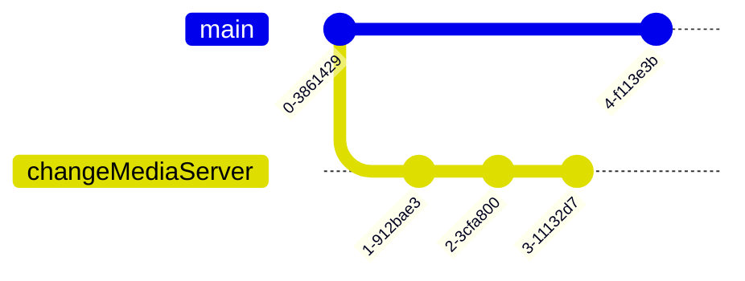

+++
title = 'Saffron - (S)erver (A)s a (F)ile (F)older (R)unning (O)n (N)etwork'
date = '2024-02-10'
subtitle = 'Distributing a docker compose system via git.'
author = 'Ivy Duggan'
draft = false
tags = [
  'dev ops',
  'docker',
  'git',
  'homelab',
  'workflow',
]
header_img = ''
description = ''
toc = true
categories = []
series = []
+++


## [Saffron](https://github.com/ivylikethevine/saffron) is a docker compose implementation of a server deployable via static files, managed as a git repository

Ever since my last <a href='/projects/homelab-design-v1'>homelab design post</a>, I have been trying to find a workflow that takes better advantage of docker compose based services. After literal months of trying various versions of container management systems, performing unholy command line shenanigans, and bashing my head into my keyboard, I have settled on `saffron`, a simple, static folder structure with docker compose files & leveraging git SVM, running a modern web interface for easy configuration & modification. And I am releasing it with all of my preconfigured docker compose services on github: [Saffron](https://github.com/ivylikethevine/saffron).

### Why Docker? Why Compose?

```yaml
# This compose file defines netdata, a Web UI for hardware monitoring.
version: "3"
services:
  netdata:
    image: netdata/netdata
    container_name: netdata
    pid: host
    network_mode: host
    restart: unless-stopped
    ports:
      - 19999:19999
    cap_add:
      - SYS_PTRACE
      - SYS_ADMIN
    volumes:
      - /containers/netdata/config:/etc/netdata
      - /containers/netdata/lib:/var/lib/netdata
      - /containers/netdata/cache:/var/cache/netdata
      - /etc/passwd:/host/etc/passwd:ro
      - /etc/group:/host/etc/group:ro
      - /etc/localtime:/etc/localtime:ro
      - /proc:/host/proc:ro
      - /sys:/host/sys:ro
    environment:
      - NETDATA_EXTRA_DEB_PACKAGES=lm_sensors
networks: {}
# This is all we need to deploy an entire service
```

Containers are great for a homelab because, like their physical counterparts, they are repositionable and movable. Servers are a pain because configuration is tedious and complicated, but containers let us use someone else's configuration.

Compose takes that further, allowing us to statically define services with configurations, easily network them, and allow complex services to easily run without complicated configuration on the host.

#### Alternatives

There are exisitng solutions for this problemspace, namely [portainer](https://www.portainer.io/) and [yacht](https://github.com/SelfhostedPro/Yacht). I've used both of these, but my primary issue with them for the simple homelab use-case is that the user does not maintain full control of the docker compose files. These solutions add a level of complexity on top of compose files, allowing (supposedly) one-click templates, complex networking, and many features that are no doubt useful in some scenario.

However, the homelab is a space where we need to maximize our compatibility and searchability. Portainer/yacht exist as supersets of docker compose, so if we can base our system on the lower level technology, we have more compability with the wealth of knowledge already on the internet. The level of tech-saviness required to grab someone else's compose file is about as simple as copy/pasting an emoji on a laptop.

Docker compose also allows us the ability to reconfigure our homelab dynamically. It is easy to run multiple different types or configurations of containers, test them for a while, then stop & remove any eliminated contenders.

#### Dockge


In comes [Dockge](https://github.com/louislam/dockge), a very nice tool that allows us to leverage the power of docker compose with very minimal difference from using a command line interface (CLI), which is (let's be real here) unbearable UI/UX for 99% of people. Instead of running its own templating system on top of docker compose, it is a simple Web UI to edit our compose files, stop, start, and edit networking & environment variables. There are some downsides when compared to editing `saffron` directly on the host device inside of a code editor (as I do on swervy, my new homelab node), but with some slight workarounds, it is much easier to diagnose issues and find solutions using docker compose & dockge than portainer or yacht in my experience.

##### Source Version Management

Additionally, dockge allows us to create an entire git managed repository that houses our compose files, `saffron`. The repository contains dockge, in addition to preconfigured docker compose files for the services I currently run on my homelab nodes. They can be turned on or off, and the user maintains complete control of their compose files.

Git allows us to track our changes, and restore working versions when things (eventually) go wrong. Our `.env` files are not stored in git, so we can (mostly) safely keep personal directory pathings, vpn credentials, and other secrets out of SVM/git.

```bash
git commit -m "initial working version"
git checkout -b changeMediaServer # trying out new client
git commit -m "new client"
git commit -m "hot fix"
git stash # new client isn't satisfactory, return to previous
git checkout main # back to functional
git commit -m "different change"
```



##### Planned Features

`saffron` itself is a starting point, because it allows for easy development of future concepts. Some of the integrations I plan to work on are as follows:

* [avahi](https://github.com/flungo-docker/avahi) - configuring this would allow internal containers to reach external \<hostname\>.local domains on LAN, which is my preferred method of networking
* [traefik](https://hub.docker.com/_/traefik) - easy docker integration allows for (in-theory) automatic routing of services (easily supported with labels, but conceptually possible as an automatic routing system)

So if you're setting up a homelab, try [Saffron](https://github.com/ivylikethevine/saffron).
